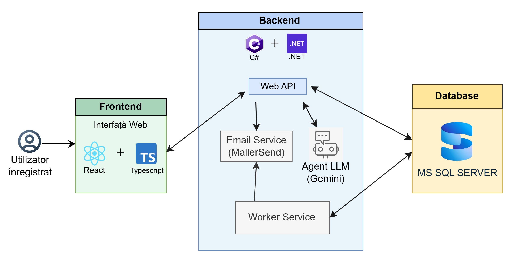
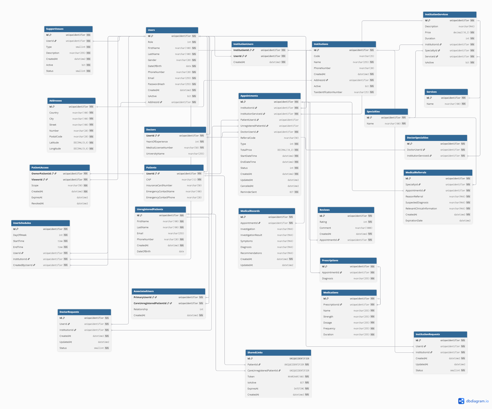
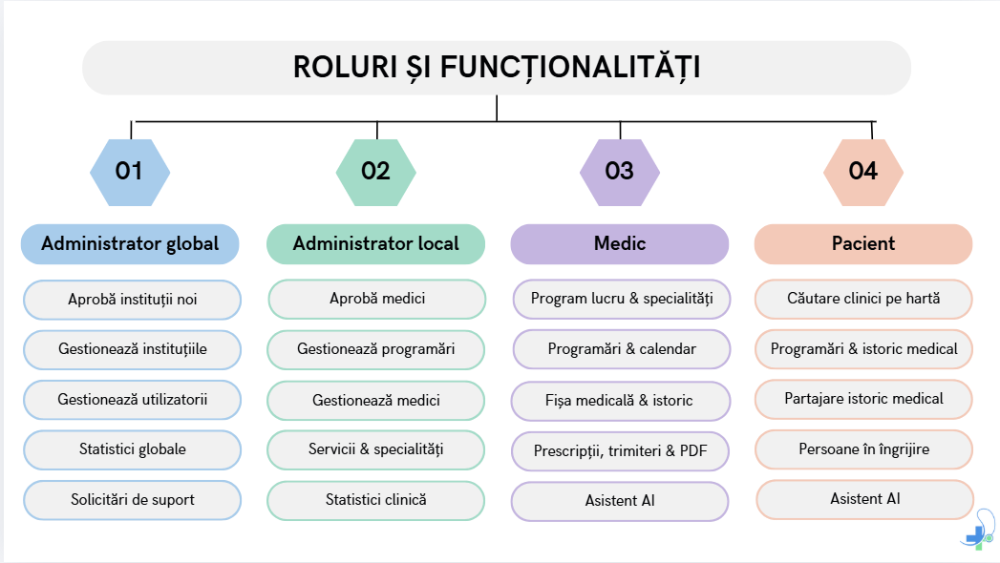

# 🏥 MedSync

> A web platform for centralized management of multiple medical clinics

MedSync provides clinics with an integrated system for managing daily operations and gives patients a unified medical history that is easy to access and share across institutions.

---

## 🛠️ Technologies Used

| Layer | Technology |
|---|---|
| Frontend | React, TypeScript |
| Backend | C#, .NET 8 (Web API + Worker Service) |
| Database | Microsoft SQL Server |
| Email | MailerSend |
| Asistent AI | Google Gemini |

---

## 🏗️ Service Architecture



---

## 🗃️ Database Architecture



---

## 👥 Roles and Features



---

## ⚙️ Prerequisities

- [Node.js](https://nodejs.org/) v18+
- [.NET SDK](https://dotnet.microsoft.com/download) v8+
- [Microsoft SQL Server](https://www.microsoft.com/en-us/sql-server)

---

## 🚀 Running Locally

### Backend

Configure `appsettings.Development.json` in the  `MedSync/` folder:

```json
{
  "ConnectionStrings": {
    "MedSyncDb": "Server=localhost\\SQLEXPRESS;Database=MedSync;Trusted_Connection=True;TrustServerCertificate=True;"
  },
  "MailerSend": {
    "ApiKey": "your_mailersend_api_key"
  },
  "Gemini": {
    "ApiKey": "your_gemini_api_key"
  },
  "MapBoxToken": {
    "AccessToken": "your_mapbox_token"
  }
}
```

```powershell
dotnet restore
dotnet ef database update
dotnet run
```

### Frontend

Configure the `.env` file in the project root:

```env
VITE_MAPBOX_TOKEN=your_mapbox_token_here
```

```powershell
npm install
npm run dev
```
